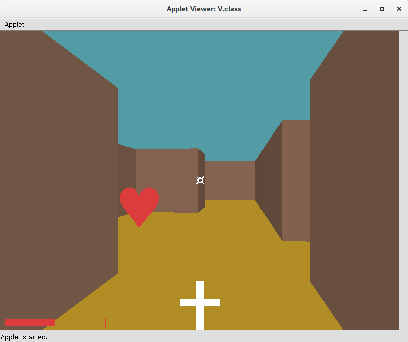
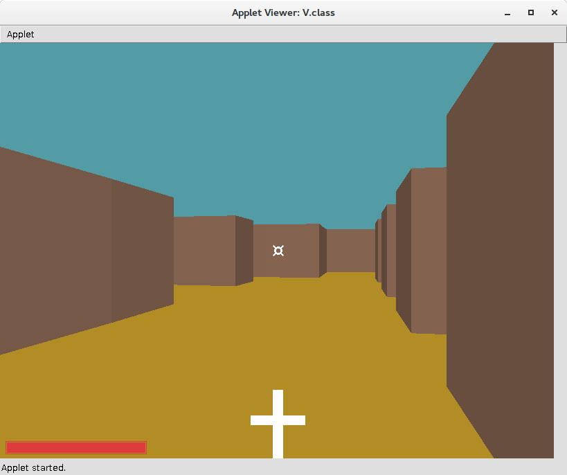
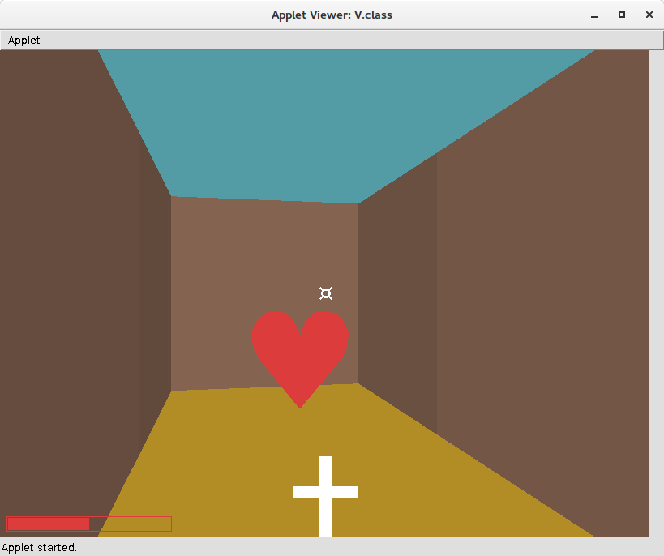
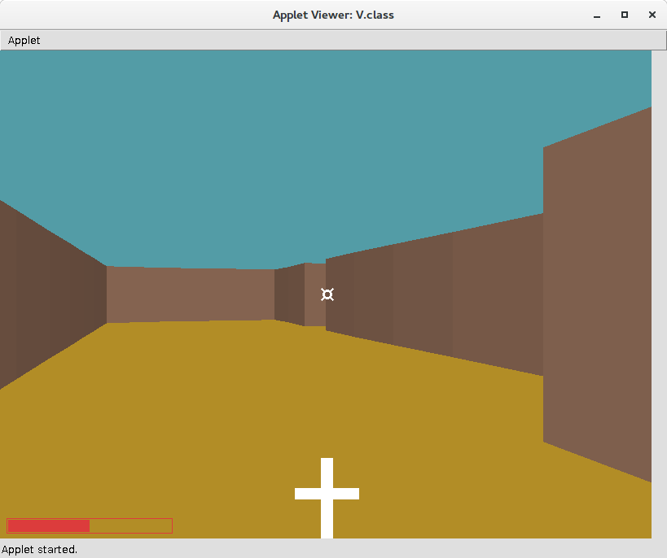

# V

V is a minimalist 3D labyrinth applet demo being less than 4 KB, 3D graphics coded manually.

## Features

- Less than 4 KB applet jar (2685 bytes!), roughly 250 lines of code
(without empty and comment lines)

- Mouse control: move cursor to turn, fire (left click)

- Keyboard control: move (up, down), stride (left, right)

- 3D view rendering with shadows, lightning effect (when firing)

- Pickup-able objects

## Screenshots

## Status

The demo was developed between November 30, 2010 and December 12. It is not maintained / developed anymore.
